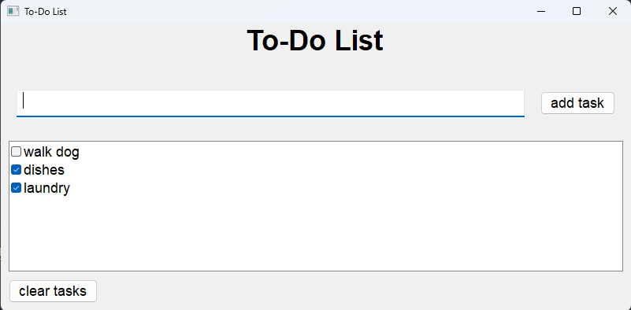

# To Do List
a C++ Windows Application for a To Do List

## Functionality
- Write and add a task
- delete a single task or clear entire task board
- tasks are saved when app is closed and will load when app is reopened

### Learning Goals
- Practice C++
- Practice CMake
- vcpkg & package management in C++
- wxWidgets & GUI